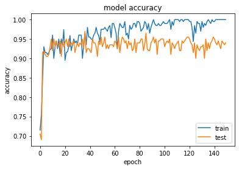

# Malware Classification
 
## Executive Summary

Malware, short for "malicious software," refers to any intrusive program created by cybercriminals (commonly referred to as "hackers") with the intent of stealing data and causing harm or destruction to computers and computer systems. Viruses, worms, Trojan horses, spyware, adware, and ransomware are all examples of prevalent malware. Data has been exfiltrated in large quantities because of recent malware attacks.
Some of the types of malwares out there are as follows:

- Virus: Mostly transferred via the email to infect a device
- Scareware: Alarming messages all over the internet that employ scare tactics to catch victims
- Spyware: Programs installed to capture private information without consent
- Ransomware: An attack where the attacker demands a ransom after hacking a person’s system
- Worms: Exploitive programs that can transmit from machine to machine by making countless copies
- Trojans: Programs that steal personal data then use it for malicious intentions
- Adware: Unwanted ads that pop-up at random to prompt unconsented install and steal personal information
- Fileless malware: Software that uses legitimate programs to infect a system etc.

## Literature Review

We started by looking at a problem that is more prevalent today. Based on this we chose malware detection as it is one of the most pressing issues currently with cyber-attacks being at an all-time high. We wanted to build a machine learning model that can be used to flag malwares. Microsoft, Kaspersky and a lot of other big tech firms use classification-based machine learning techniques to flag malicious software. Based on our research and reading various papers on the topic, we found out that the highest accuracy achieved by the machine learning algorithms in detecting malicious software is over 98%. So, our end goal is not to improve the accuracy of the algorithms as that would require a lot of processing power. Instead, we decided on 9 classes of malicious software’s that have the most hit rate and build a model that can classify based on those 9 classes.
As discussed in class, we divided our work in two levels:

1. Level - 1: Build a model using 2 classes (Predict if a software is malicious or not)
2. Level – 2,3: Build a model using 9 classes (Predict if a software belongs to one of the 9 classes of the malicious software’s)

## Dataset

Data Source: [Kaggle Malware Classification]("https://www.kaggle.com/c/malware-classification")

We have two files for every malware

- .asm file
- .bytes file (the raw data contains the hexadecimal representation of the file's binary content, without the PE header)

Total train dataset consist of 200GB data out of which 50Gb of data is .bytes files and 150GB of data is .asm files. We have a total of 10,868 .bytes files and 10,868 asm files in total 21,736 files. The dataset is unbalanced and there are 9 types of malwares (9 classes) in our data.

Types of Malwares:
- Ramnit
- Lollipop
- Kelihos_ver3
- Vundo
- Simda
- Tracur
- Kelihos_ver1
- Obfuscator.ACY
- Gatak

Feature Extraction:

1. N-gram features of .bytes file: We tried using uni-gram (About 256 features).
2. Extract size of both .byte and .asm files.
3. For .bytes file: Extract 9 features converted to values between 0 and 1 where the sum of the values should be equal to 1.

## Exploratory Data Analysis

The dataset is unbalanced which we can see from the plot below:

  

The boxplot of .bytes file size distributions:

## Analysis

### LEVEL - 1: ANALYSIS ON A 2-CLASS DATA

**Process Flow**

Data Cleaning and Pre-processing:

1. Convert the image files to grayscale image with a dimension of 256x256.
2. In total, we have about 1416 executables that were converted to grayscale images as shown below.

  

3. Train test split is 80-20% and the dataset have 50-50% split of malign ware and benign ware files.

**Models**

1. Used CNN architecture with 6 layers, where activation function for first layers is ReLU and the last layer is Sigmoid. Optimizer is Adam and loss function is binary cross-entropy.
2. Accuracy and loss function plots as shown below:

  
   

**Conclusion**

1. With 150 epochs, the model accuracy is 94% on test set.
2. Based on our analysis, we can summarize the following:

### LEVEL – 2,3: ANALYSIS ON A 9-CLASS DATA

**Process Flow**

Data Cleaning and Pre-processing:

1. Segregate .asm and .bytes files into separate folders. Then convert the .bytes files into text files to extract features.
2. In total, we have about 1780 files 8 gigs of .bytes files and 22 gigs of .asm files. For this example, we are working with a subset of the data and the entire analysis was run locally.

**Models**

1. For feature extraction on both .bytes and .asm files we used bag of words methods which is also known as the unigram method. It is used to extract features from the .bytes files which have been converted to .txt files.
2. We have custom built a unigram bag of words to extract features. This is followed by train, cross validation, and test splits of the data. We used stratified data split for this analysis.
3. Then we built a number of machine learning models as follows:
	- Random Model.
	- K-Nearest Neighbor.
	- Logistic Regression.
	- Random Forest.
	- XGBoost.
	- XGBoost with Hyperparameters Tuning.
4. We print the confusion matric which is a 9x9 in this case considering the 9-classes and output the log-loss and misclassification rate for each model.
5. Below is a little snip of the Random Forest model confusion matrix that shows the best metrics for .bytes files.

  
   

  
   

6. Below is a little snip of the Random Forest model confusion matrix that shows the best metrics for .asm files.

  
   

  
   

**Conclusion**

1. Model summary as shown below:

  

2. Based on our analysis, we can summarize the following:

## Conclusion

From our analysis, for .bytes files the best model is Hyperparameter tuned XGBoost model with log-loss of 0.15 on cross-validation split and 0.11 on test split. Misclassified points of about 1.4. For .asm files the best model is Random Forest model with log-loss of 0.06 on cross-validation and 0.09 on test set. Misclassified points of about 1.4. The performance metric log-loss needs to be minimized, so the closer it to zero the better. If we need to find the best model, then Random Forest is the best for both .bytes and .asm files.
For future scope, we can try building a combined feature set for .bytes and .asm files and build ML models and see which model performs the best in terms of log-loss and misclassification points. We can also try other methods like bi-gram and tri-gram to extract more features to minimize multi loss even more. Our analysis was on limited dataset of 30GB, we can do the same analysis on the entire dataset which is around 200GB on cloud and compare model performance in terms of metrics and time taken.

## Learning's

This was an interesting project as I got an opportunity to work on a huge dataset which was imbalanced and utilized cloud platforms like Google Cloud (GCP). I have also learnt advanced feature engineering techniques like resampling imbalanced data, creating new features, handling missing values etc. I have experimented with various ML algorithms like Random Model, K-Nearest Neighbor, Logistic Regression, Random Forest, XGBoost, XGBoost with Hyperparameters Tuning etc. out of which the best performing model was the Random Forest Model (With the lowest Log-Loss and Misclassification rate). I have also got to build some very complex confusion matrix which took a while for me to make sense of. In the business context, the accuracy of the model is 94% which is good enough but can be improved further by applying more advanced features extraction and data pre-processing techniques and trying out other hyperparameter tuned models.

## References

- https://www.cisco.com/c/en/us/products/security/advanced-malware-protection/what-is-malware.html
- https://www.mcafee.com/en-us/antivirus/malware.html
- https://stackoverflow.com/a/29651514
- https://docs.scipy.org/doc/numpy/reference/generated/numpy.argsort.html
- https://stackoverflow.com/a/18662466/4084039
- http://scikit-learn.org/stable/modules/generated/sklearn.neighbors.KNeighborsClassifier.html
- http://scikit-learn.org/stable/modules/generated/sklearn.calibration.CalibratedClassifierCV.html
- http://scikit-learn.org/stable/modules/generated/sklearn.linear_model.SGDClassifier.html
- http://xgboost.readthedocs.io/en/latest/python/python_api.html?#xgboost.XGBClassifier
- https://www.analyticsvidhya.com/blog/2016/03/complete-guide-parameter-tuning-xgboost-with-codes-python/